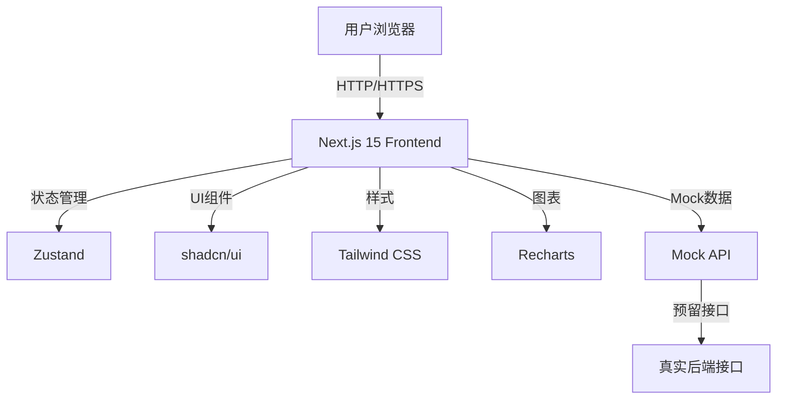

## 1. Architecture Design


## 2. Technology Description
- Frontend: Next.js 15 + React 18 + TypeScript + Tailwind CSS + shadcn/ui
- Initialization Tool: create-next-app
- State Management: Zustand
- Chart Library: Recharts
- Backend: 预留接口位置，可对接任何后端服务
- Deployment: Vercel

## 3. Route Definitions
| Route | Purpose |
|-------|---------|
| / | 今日计划页面 |
| /profile | 完善资料页面 |
| /tracker | 数据追踪页面 |
| /settings | 偏好与设置页面 |

## 4. Data Model
### 4.1 主要数据模型

```typescript
// 用户个人资料
interface UserProfile {
  id: string;
  name: string;
  height: number; // cm
  weight: number; // kg
  chest: number; // cm
  waist: number; // cm
  hips: number; // cm
  goal: 'lose' | 'gain' | 'shape';
  allergies: string[];
  dietType: string;
  waterGoal: number; // ml
  updatedAt: string;
}

// 每日计划
interface DailyPlan {
  date: string;
  calories: {
    total: number;
    consumed: number;
    remaining: number;
  };
  macros: {
    protein: { current: number; goal: number };
    carbs: { current: number; goal: number };
    fat: { current: number; goal: number };
  };
  meals: Meal[];
  waterIntake: number;
  waterGoal: number;
  workouts: Workout[];
}

// 餐食
interface Meal {
  id: string;
  type: 'breakfast' | 'lunch' | 'dinner' | 'snack';
  name: string;
  time: string;
  calories: number;
}

// 运动
interface Workout {
  id: string;
  name: string;
  type: string;
  duration: number; // minutes
  calories: number;
  completed: boolean;
}

// 数据追踪记录
interface TrackerRecord {
  date: string;
  weight: number;
  chest: number;
  waist: number;
  hips: number;
  caloriesConsumed: number;
  caloriesBurned: number;
  waterIntake: number;
}

// 设置
interface Settings {
  mealTimes: {
    breakfast: string;
    lunch: string;
    snack: string;
    dinner: string;
  };
  notifications: {
    water: boolean;
    meal: boolean;
    workout: boolean;
    checkin: boolean;
  };
  dietMode: string;
}
```

## 5. Project Structure
```
/workspace
├── app/                    # Next.js 15 App Router
│   ├── layout.tsx         # Root layout
│   ├── page.tsx           # 今日计划页面
│   ├── profile/           # 完善资料页面
│   ├── tracker/           # 数据追踪页面
│   └── settings/          # 偏好与设置页面
├── components/
│   ├── ui/                # shadcn/ui 组件
│   ├── layout/            # 布局组件（导航栏等）
│   └── features/          # 功能组件
├── lib/
│   ├── utils.ts           # 工具函数
│   ├── hooks.ts           # 自定义hooks
│   └── store.ts           # Zustand store
├── mock/                  # Mock数据
├── public/                # 静态资源
├── next.config.js         # Next.js配置
├── tailwind.config.js     # Tailwind配置
└── tsconfig.json          # TypeScript配置
```

## 6. State Management
使用 Zustand 进行状态管理，主要 store 包括：
- userStore: 用户资料管理
- dailyPlanStore: 每日计划管理
- settingsStore: 设置管理

## 7. Mock API
在 `/mock` 目录下提供完整的 Mock 数据，并在代码中预留真实 API 接口位置，方便后续对接。
